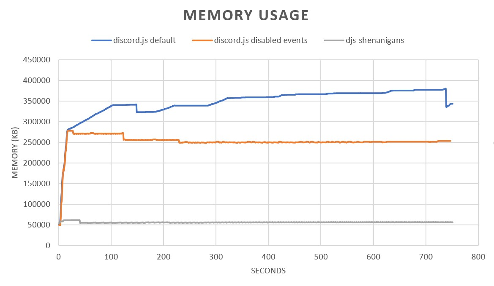
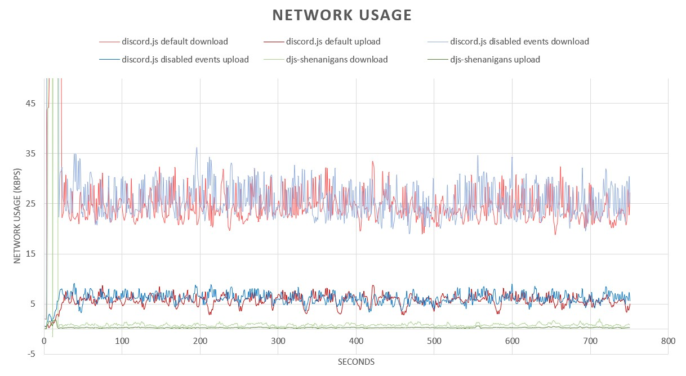

# djs-shenanigans

A modified Discord client built on top of [discord.js](https://github.com/discordjs/discord.js) 12.0.0, Shenanigans aims to drastically reduce discord.js's resource usage while also adding its own set of utilities. This package is very experimental and should be used with caution and lots of testing, as it may disable or break some of discord.js's features.

## Features

djs-shenanigans tweaks discord.js by removing some of its features for performance gains and adding some other features on top.

Pros:

* Drastically lower cpu, memory and network usage (see performance section)
* Built-in automatic sharding, command handlers, error handler, custom prefix handler and discordbots.org updater
* On-demand caching (data is cached only when used, say goodbye to sweeping)
* Designed to run as replicable independent instances (compatible with pm2 cluster)
* Some additional functions and methods for convenience (see non-standard API section)

Cons:

* Most events are disabled or are handled differently (see non-standard behavior section)
* Some features that rely on cached data might require additional handling (see non-standard behavior section)
* Presences and typing events are permanently disabled (more a pro than a con)
* Some features have not been tested (ie: voice)

## Getting Started

Installation:

```npm install timotejroiko/djs-shenanigans```

optional packages (recommended to improve performance, especially zlib-sync. dont use zucc)

```
npm install zlib-sync
npm install bufferutil
npm install discordapp/erlpack (if it doesnt work, use this fork: churchofthought/erlpack)
npm install utf-8-validate
```

Simple usage:

```js
const client = require("djs-shenanigans")(); // good old discord.js client

client.on("message", message => {
	// do stuff
});

client.login("TOKEN")
```

With auto-login, auto-sharding, logging, prefix and command handlers:

```js
const client = require("djs-shenanigans")({
	token:"TOKEN",
	defaultPrefix:"!",
	enableLogger: true,
	enableHandler: "YOURCOMMANDSFOLDER",
	sendErrors:true
});

// create commands in your command folder (see command handlers section)
```

## Client options

All fields are optional.

| Option | Type | Description |
| ------------- | ------------- | ------------- |
| token | string | Your discord bot token. If provided, the client will attempt to negotiate shards and login automatically, else you will need to run client.login() and manually specify shard settings |
| dblToken | string | Your discordbots.org token. If provided, the client will send your guild count to discordbots.org every 24 hours |
| dblTest | boolean | If set to true, the client will also send your guild count to discordbots.org immediatelly after logging in |
| owners | array | Array of user IDs. Used by the non-standard method message.isOwner |
| processes | number | Total number of processes running this bot if running multiple instances manually. Ignored when using pm2 cluster mode |
| process | number | The zero-indexed id of the current process if running multiple instances manually. Ignored when using pm2 cluster mode |
| shardsPerProcess | number | Manually specify the number of shards each process should spawn. Uses recommended shards if omitted or set to "auto" |
| defaultPrefix | string | Default prefix for all guilds and dms |
| customPrefix | function(guildID) | Function that should return a guild-specific prefix from a guild id |
| enableLogger | boolean | Enables logging of connection statuses, messages and errors |
| enableHandler | boolean/string | Command handler mode. See command handlers section |
| sendErrors | boolean | If set to true, the command handler will also attempt to send command errors instead of only logging them |

## Command handlers

djs-shenanigans has 3 different ways of working depending on the command handler mode. The command handler will process all messages that start with a valid custom prefix, a default prefix or a bot mention. All other messages will be ignored. All bot responses are cached by default. The command handler also listens to message edits and processes them as new messages. You can differentiate between new and updated messages by checking for the existence of message.editedTimestamp. If responding to a message edit using message.send(), the response will be sent as a message edit if the previous response is cached (see non-standard API). When using Router or File mode, empty commands (prefix + nothing or mention + nothing) will be processed as a "nocommand" command.

### Message Event Mode

options.enableHandler set to false or omitted.

In this mode, client will listen to messages that start with a valid prefix and emit them as a "message" event. This is the most barebones setup, messages are captured from the raw event, checked for prefixes and bot users and then emitted. You can also use this event to capture messages from whitelisted channels, regardless of command handler mode (see non-standard API). Example:

```js
const client = require("djs-shenanigans")({
	defaultPrefix:"!"
});

client.on("message", message => {
	// messages from non-bot users which start with a valid prefix are received (ie: "!somecommand")
	// the message itself is not cached, but its channel and author/member are automatically cached.
	// you must handle commands and errors by yourself
	// also receives messages from whitelisted channels regardless of command handler mode
});
```

### Router Mode

options.enableHandler set to true.

In this mode, client will listen to messages that start with a valid prefix and contain a command registered as an event. This is for those who like the idea of handling commands like a webserver. Registered command events are prefixed with a slash to avoid interfering with standard events. Example:

```js
const client = require("djs-shenanigans")({
	defaultPrefix:"!",
	enableHandler:true
});

client.on("/ping", message => {
	// only messages from non-bot users which start with a valid prefix followed by the command "ping" are received (ie: "!ping")
	// this message, its channel and author/member are automatically cached.
});

client.on("/nocommand", message => {
	// empty commands go here (ie: prefix+nothing or mention+nothing)
})
```

### File Mode

options.enableHandler set to a string pointing to a folder.

In this mode, client will listen to messages that start with a valid prefix and contain a valid command file. This is the standard command handler approach, the client will scan the supplied folder and register all files found as commands using their file names. This mode also enables a built-in command reloading function (see non-standard API). Example:

```js
// index.js
const client = require("djs-shenanigans")({
	defaultPrefix:"!",
	enableHandler:"commands"
});

// scans the "commands" folder for js files and registers them in client.commands
// client.commands is a Map object with the file name serving as the key, and its exported functions as the value.
```

```js
// commands/ping.js
module.exports.run = message => {
	// only messages from non-bot users which start with a valid prefix followed by the command "ping" are received (ie: "!ping")
	// this message, its channel and author/member are automatically cached.
	// errors that happen inside here are handled and logged automatically. if options.sendErrors is set to true, the error is also sent as a response
	// commands must contain a "run" function, other props such as module.exports.help can be optionally added for management and interaction with client.commands
}
```

```js
// commands/nocommand.js
module.exports.run = message => {
	// empty commands go here (ie: prefix+nothing or mention+nothing)
}
```

## Non-standard API

djs-shenanigans has some extra functions built in for convenience:

| Func/Prop | Returns | Description |
| ------------- | ------------- | ------------- |
| message.send(content,options) | promise>message | This function is the same as message.channel.send() but adds several improvements: automatically resolves promises and converts objects to text, truncates large strings if no split options are provided, detects and warns about errors and failures when sending, logs response time and errors if logging is enabled, adds request and response pairing if messages are cached, if possible sends responses as edits when triggered by message edits. |
| message.commandResponse | message | The message object that was sent as a response to this command. Only available if it was sent with message.send() and the message is cached |
| message.commandMessage | message | The message object that was received to trigger this response. Only available if this response was sent with message.send() and the triggering message is cached. |
| message.commandResponseTime | number | Message response time in milliseconds. Only available in response messages if they were sent with message.send() and are cached; |
| message.command | string | The command used without prefix and content. Only available with the command handler in router or file mode |
| message.argument | string | The message content without prefix and command. Only available with the command handler in router or file mode |
| message.isOwner | boolean | Quickly check if the user who sent the message is a bot owner. Uses the array of owners from options.owners |
| channel.createCollector(filter,options) | messageCollector | The same as channel.createMessageCollector() but whitelists the channel during the duration of the collector, to receive all messages instead of only messages starting with a valid prefix or command |
| channel.whitelisted | boolean | If set to true, this channel will fire "message" events for all messages, instead of only messages that start with a valid prefix. |
| client.shutdown() | boolean | Begins graceful shutdown in this process, replaces all functions and commands with a temporary message and exits the process after a few seconds |
| client.asyncEval() | promise>anything | An eval function compatible with promises and async/await syntax |
| client.pm2shutdown() | boolean | Sends a shutdown signal to all processes in the pm2 cluster. Only available when running in pm2 cluster mode |
| client.survey(string) | promise>array | Similar to broadcastEval() but for pm2 clusters. Sends a string to be evaluated by all processes in the cluster and returns an array of responses indexed by process number. Only available when running in pm2 cluster mode |
| client.broadcast(string) | promise>array | Same as client.survey() but it does not wait for a response. It returns an array of booleans representing whether the message was received by the target processes or not. Only available when running in pm2 cluster mode |
| client.commands | map | Where commands are stored when running the command handler in file mode |
| client.commands.reload(command) | boolean | Function to reload a command managed by the command handler in file mode. Can be used to add/change command files without restarting the bot. |

## Non-standard behavior

Since this library tampers with discord.js's functions and caches, there is a lot of unexpected behavior, here are a few documented behavior changes from my tests (there might be other untested unexpected behaviors, feel free to contribute with your tests and use cases)

| Subject | Changes |
| ------------- | ------------- |
| reactions | All message reaction events and collectors should work, but the reaction object is a bit different and might contain partials (a partial is an object that only contains an id and nothing else) |
| reaction.channel | The channel object or channel partial if not cached |
| reaction.message | The message object or message partial if not cached |
| reaction.guild | The guild object or null if DM |
| reaction.user | The user object or user partial if not cached |
| reaction.emoji | The emoji object as per the Discord Gateway API (not the reaction emoji object from discord.js) |
| channels | Channels are cached only when used, messages are only cached when using a command handler, permissions are never cached |
| channel.messages | Caches only messages that were processed by the command handler in router or file mode |
| channel.permissionOverwrites | Always empty, unless manually cached by channel.fetch() or channels.fetch(id) |
| guilds | All guilds are cached and auto-updated by default but they do not contain everything |
| guild.channels | Caches only channels where commands were used |
| guild.members | Caches only members that used commands. Specific members can be cached by guild.members.fetch(id) (fetching all members ir not recommended and will probably not work) |
| guild.roles | Always empty, unless manually cached using guild.fetch() or guild.roles.fetch() |
| guild.emojis | Always empty, unless manually cached using guild.fetch() |
| guild.presences | Always empty |
| guild.voiceStates | Always empty |
| client.users | Caches only users that used commands. Specific users can be cached by client.users.fetch(id) |
| events | Many events are modified or disabled |
| message update | The message update event is disabled, but message updates are processed by the command handler |
| message delete/deletebulk | Message delete events are fired only by whitelisted channels |
| guild member / roles / emojis / integrations / bans | These events are all disabled. Member update and delete are internally processed for cached members |
| channel create / update / delete / pins | These are all disabled. Update and delete are internally processed for cached channels |
| user updates / webhooks / voice states / presences / typing | These are all disabled. User updates are internally processed for cached users |

## PM2 Cluter Mode

djs-shenanigans is compatible with pm2 clusters, all you need to do is run it like this:

```
pm2 start yourFileName.js -i numberOfProcesses --name=yourProcessName
```

To scale your bot, all processes need to be restarted. This can also be done easily with pm2 clusters:

```
pm2 scale yourProcessName numberOfProcesses && pm2 restart yourProcessName
```

When running in pm2 cluster mode, you have access to cluster specific functions such as client.broadcast() client.survey() and client.pm2shutdown().
Cluster mode automatically negotiates shards and spreads them equally across processes, or you can set a specific amount of shards using options.shardsPerProcess.
Client logins are queued using a lockfile to avoid too many login attempts.

## Manual Instances

Running multiple instances manually across a single machine or multiple machines is possible but each instance must be configured with a process id and total processes count in the client options. Sharding is then negotiated automatically. Be aware that login queueing will not be available, so you will need wait for each process to fully login before firing another process to avoid being banned by discord (discord only allows one login every 5 seconds, shards count as logins), as well as use your own inter-process communication if needed. You can also use a master process to control everything like traditional sharders.

## Performance

This test case was done on ubuntu 18 (1vcpu, 1gb ram) running around 1500 guilds with all optional libraries installed (zlib-sync, erlpack, bufferutil, utf-8-validate). Data was recorded using `top` and `nethogs`. The following scripts were used:

```js
// discord.js default settings
const { Client } = require("discord.js");
const client = new Client();
client.login("TOKEN");
```

```js
// discord.js with most things disabled
const { Client } = require("discord.js");
const client = new Client({
    messageCacheMaxSize:0,
    messageCacheLifetime:30,
    messageSweepInterval:60,
    disableEveryone:true,
    disabledEvents:["GUILD_MEMBER_ADD","GUILD_MEMBER_REMOVE","GUILD_MEMBER_UPDATE","GUILD_MEMBERS_CHUNK","GUILD_INTEGRATIONS_UPDATE","GUILD_ROLE_CREATE","GUILD_ROLE_DELETE","GUILD_ROLE_UPDATE","GUILD_BAN_ADD","GUILD_BAN_REMOVE","GUILD_EMOJIS_UPDATE","CHANNEL_PINS_UPDATE","CHANNEL_CREATE","CHANNEL_DELETE","CHANNEL_UPDATE","MESSAGE_CREATE","MESSAGE_DELETE","MESSAGE_UPDATE","MESSAGE_DELETE_BULK","MESSAGE_REACTION_ADD","MESSAGE_REACTION_REMOVE","MESSAGE_REACTION_REMOVE_ALL","USER_UPDATE","USER_SETTINGS_UPDATE","PRESENCE_UPDATE","TYPING_START","VOICE_STATE_UPDATE","VOICE_SERVER_UPDATE","WEBHOOKS_UPDATE"]
});
client.login("TOKEN");
```

```js
// djs-shenanigans
const client = require("djs-shenanigans")({
	token:"TOKEN",
	defaultPrefix:"!",
	enableLogger: true,
	enableHandler: "commands",
	sendErrors:true
});
```

Results:





As you can see, djs-shenanigans uses significantly less resources compared to discord.js v12 in this test case. Roughly 5-6x less memory, 5-10x less cpu and 5-20x less network bandwidth.

## About

This project is highly experimental, so the code is quite rough and there might be bugs and broken features especially with untested features and scenarios. You are encouraged make your own tests with your specific use cases and post any issues, questions, suggestions or contributions you might find.

You can also find me in my [discord](https://discord.gg/y9zT7GN) (Tim#2373)