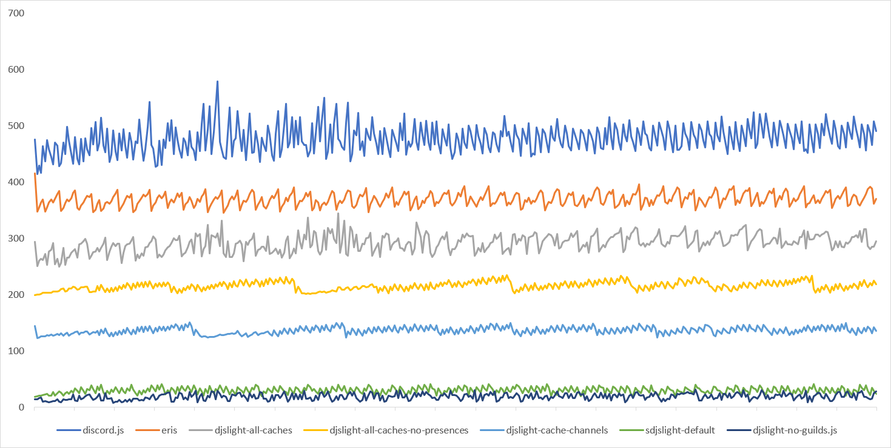

# discord.js-light

**This is the readme for the unreleased version 3. For the current stable release check the v2 branch.**

All the power of [discord.js](https://discord.js.org), zero caching.

This library modifies discord.js's internal classes and functions in order to give you full control over its caching behavior. Say goodbye to exorbitant memory usage!

[](https://www.npmjs.com/package/discord.js-light)
[](https://github.com/timotejroiko/discord.js-light/releases)
[](https://discord.js.org)
[](https://nodejs.org)
[](https://discord.gg/BpeedKh)
[](https://www.patreon.com/timotejroiko)


## Why?

Discord.js has been THE javascript discord library for a long time now, and successfully powers thousands of bots, but as your bot grows larger, you will notice a substantial increase in resource usage, especially in memory consumption.

This is because discord.js caches as much as it can in order to avoid hitting the Discord API as well as to better provide many of its features. This can however make your bots feel bloated because the library is caching and processing data that your bot will likely never use.

This library solves the problem by giving developers full control over how and when discord.js should cache the data it receives from the API.


## The Impact of Caching

Caching is the process of keeping a copy of something in memory. Most Discord libraries will keep data received from Discord in memory for any eventual needs. Caching Discord data gives you access to features such as looping through channels, finding something by name or by anything other than an ID, keeping a backup of old data accessible to update and delete events, perform permission checking and so on. Caching is very useful and makes a lot of features possible, but at a cost...

The following test is a \~3 hour run (each tick is 10 minutes), with \~3700 guilds total (4 internal shards), with all intents enabled (including presences), and with message caching disabled (messageCacheMaxSize:0). This test measures caching overhead by periodically checking `process.memoryUsage().heapUsed` in MB. Your actual memory usage still depends on your code and the node.js overhead so it will likely be higher.



As you can see, excessive caching can be very costly in terms of memory requirments, especially at scale, and unfortunately neither discord.js nor eris, the two most popular javascript libraries, provide a way to control or disable parts of their caching systems. The ability to selectively disable caches that your bot doesnt need can greatly reduce resource usage, so much that it becomes invaluable at scale.

More and more projects are being developed with such flexibility in mind, such as `klasa-core` and `detritus`, and this library brings this much needed caching flexibility to discord.js with as little side effects as possible.


## Features

* Provides all of discord.js's events without any kind of automated caching
* Most structures remain intact so your existing discord.js code should work without many changes
* Custom partials system ensures events always emit regardless of caching state
* Partials are given when data is missing and most things can be manually fetched and/or cached when needed
* Drastically lower resource usage at scale


## Usage

### Installation:

```npm install timotekroiko/discord.js-light#v3```

Optional packages (recommended to reduce bandwidth usage and improve websocket performance). These packages are plug and play, just install and they will be picked up automatically.

```
npm install zlib-sync
npm install bufferutil
npm install discordapp/erlpack
npm install utf-8-validate
```

Additionally, using an alternative memory allocator such as [jemalloc](http://jemalloc.net/) can further reduce memory usage by avoiding fragmentation in exchange for slightly higher cpu usage.

### Usage example:

```js
const Discord = require("discord.js-light");
const client = new Discord.Client();

client.on("ready", () => {
	console.log("client ready");
});

client.on("message", message => {
	if(message.content === "?!ping") {
		message.reply("pong");
	}
});

client.login("TOKEN").catch(console.error);
```

Generally, usage should be identical to discord.js and you can safely refer to its documentation as long as you respect the caching differences explained below.


## Client Options and Caching Behavior

The following client options are available to control caching behavior:

| Option | Type | Default | Description |
| ------------- | ------------- | ------------- | ------------- |
| cacheGuilds | boolean | true | Enables caching of all Guilds at login |
| cacheChannels | boolean | false | Enables caching of all Channels at login |
| cacheOverwrites | boolean | false | Enables PermissionOverwrites in cached and fetched channels |
| cacheRoles | boolean | false | Enables caching of all Roles at login |
| cacheEmojis | boolean | false | Enables caching of all Emojis at login |
| cachePresences | boolean | false | Enables caching of all Presences. If not enabled, Presences will be cached only for cached Users |

If `cacheGuilds` is disabled, the library will give up control of guilds and emit `guildCreate` events as per the Discord API, including the initial `GUILD_CREATE` packets as well as when guilds come back from being unavailable, so that you can implement your own guild tracking.

Users and Members are never cached automatically. The `fetchAllMembers` client option can be used to cache them, otherwise they must be manually fetched if required. Events that include User and/or Member data may not require fetching as the event itself contains enough information to provide them.

Voice States will be cached if the `GUILD_VOICE_STATES` intent is enabled (required for voice features to work).

Caching of Roles and PermissionOverwrites is required for permission checking functions to work correctly. If permission checking is desired, the ideal setup is to enable `cacheRoles` and `cacheOverwrites` and then manually fetch channels before checking.

This library implements its own partials system, therefore the `partials` client option is not available. All other discord.js client options continue to be available and should work normally.


## Events Behavior

Most events should be identical to the originals aside from the caching behavior and they always emit regardless of the required data being cached or not. When required data is missing, a partial structure where only an id is guaranteed will be given (the `.partial` property is not guaranteed to exist).

Events that emit past versions of a structure, such as update events, will emit `null` if not cached instead of not being emitted at all.

| Event | Emits | Notes |
| ------------- | ------------- | ------------- |
| message | Message | Includes some User and Member data |
| messageUpdate | Message?,  Message | Old Message is null if not cached. New Message includes some User and Member data |
| messageDelete | Message | Partial Message if not cached |
| messageDeleteBulk | Collection | Collection of deleted Messages or Partial Messages as above |
| messageReactionAdd | Reaction,  User | Includes some User and Member data (partial if DMs) |
| messageReactionRemove | Reaction,  User | Partial User if not cached |
| messageReactionRemoveAll | Message | Partial Message if not cached |
| messageReactionRemoveEmoji | Reaction | - |
| channelCreate | Channel | - |
| channelUpdate | Channel?,  Channel | Old Channel is NULL if not cached |
| channelDelete | Channel | - |
| channelPinsUpdate | Channel,  Date | Partial Channel if not cached |
| roleCreate | Role | - |
| roleUpdate | Role?,  Role | Old Role is NULL if not cached |
| roleDelete | Role | Partial Role if not cached |
| inviteCreate | Invite | Includes some User data |
| inviteDelete | Invite | - |
| emojiCreate | Emoji | Only emits if Emojis are cached |
| emojiUpdate | Emoji,  Emoji | Only emits if Emojis are cached |
| emojiDelete | Emoji | Only emits if Emojis are cached |
| guildEmojisUpdate | Collection | Non-standard event. Emitted instead of Emoji events when Emojis are not cached. Provides a Collection of updated Emojis |
| guildBanAdd | Guild,  User | Partial Guild if not cached |
| guildBanRemove | Guild,  User | Partial Guild if not cached |
| guildCreate | Guild | Does not include disabled data |
| guildUpdate | Guild?,  Guild | Old Guild is NULL if not cached |
| guildDelete | Guild | Partial Guild if not cached |
| guildUnavailable | Guild | Partial Guild if not cached |
| guildMemberAdd | Member | Includes some User data |
| guildMemberUpdate | Member?,  Member | Old Member is NULL if not cached. new Member includes some User data |
| guildMemberRemove | Member | Partial Member if not cached |
| guildIntegrationsUpdate | Guild | Partial Guild if not cached |
| presenceUpdate | Presence?,  Presence | Old Presence is NULL if not cached. New Presence includes some Member data |
| typingStart | Channel,  User | Partial Channel. Includes some User and Member data (partial if DMs) |
| userUpdate | User?,  User | Old User is NULL if not cached |
| voiceStateUpdate | VoiceState?,  VoiceState? | NULL when data does not include a Channel ID (indicates disconnection). Includes some User and Member data |
| webhookUpdate | Channel | Partial Channel if not cached |
| shardConnect | Number,  Collection | Non-standard event. Emitted when a shard connects to Discord. Provides a Shard ID and a Collection of Partial Guilds assigned to this shard |

Events that include some User and/or Member data will contain User and/or Member objects even if not cached, for example `message.author` will always contain a full User object, including most of its properties, even if said user is not cached.

Non-partial structures only guarantee the contents of its top-level properties. Linked structures such as message`.channel` or reaction`.message` may still be partials if not previously cached or fetched. This is especially true for Guild objects, which do not include Roles, Emojis, Channels, Members, Presences or VoiceStates unless previously cached, fetched, enabled or other conditions met.

Events not listed above should work normally as per the discord.js documentation.


## Fetch Methods

Fetch methods are used to obtain data from the Discord API when needed and optionally cached for reuse. Once data is cached, it will remain in the cache until manually removed. Cached data will be automatically updated as new Discord events are received.

Some fetch methods are already included in by default discord.js, others were added or tweaked as below:

### client.channels.fetch()

`.fetch(id)`  
`.fetch(id,cache)`  
`.fetch(id,options)`  
`.fetch(options)`  

**`returns`** - `Promise (Channel)`

Fetches a channel from the `/channels/:id` endpoint. This method is identical to the original except that it includes an additional `withOverwrites` option.

* **`id or options.id (string)`** - id of the channel to fetch.
* **`cache or options.cache (boolean)`** - whether to cache the result. defaults to true.
* **`options.withOverwrites (boolean)`** - whether to include permissionOverwrites. always true if the `cacheOverwrites` client option is enabled or if guild roles are cached, otherwise defaults to false.

### client.guilds.fetch()

`.fetch()`  
`.fetch(cache)`  
`.fetch(id)`  
`.fetch(id,cache)`  
`.fetch(id,options)`  
`.fetch(options)`  

**`returns`** - `Promise (Guild | Collection of Guilds)`

Fetches a single guild from the `/guilds/:id` endpoint, or multiple guilds from the `/users/@me/guilds` endpoint. When fetching multiple guilds, only basic information about each guild is returned. Additionally fetching multiple guilds is extremely slow, taking roughly 20 seconds per 1000 guilds. If you need to fetch thousands of guilds, its much faster to create a new connection to the gateway. Fetching multiple guilds also bypasses the guild cache, whereas fetching a specific guild id will always check the cache first.

* **`id or options.id (string)`** - id of the guild to fetch. if not provided, fetches all guilds instead.
* **`cache or options.cache (boolean)`** - whether to cache the results. defaults to true.
* **`options.limit (number)`** - max amount of results (0 for no limit). defaults to 0.
* **`options.before (string)`** - a guild id to search only guilds with a smaller id (0 for any). defaults to 0.
* **`options.after (string)`** - a guild id to search only guilds with a bigger id (0 for any). defaults to 0.

### guild.channels.fetch()

`.fetch()`  
`.fetch(cache)`  
`.fetch(id)`  
`.fetch(id,cache)`  
`.fetch(id,options)`  
`.fetch(options)`  

**`returns`** - `Promise (Channel | Collection of Channels)`

Fetches channels from the `/guilds/:id/channels` endpoint. This endpoint bypasses the `VIEW_CHANNEL` permission. Fetching all channels also bypasses the channel cache, whereas fetching a specific channel id always checks the cache first.

* **`id or options.id (string)`** - id of the channel to fetch. if not provided, fetches all guild channels instead.
* **`cache or options.cache (boolean)`** - whether to cache the results. defaults to true.
* **`options.withOverwrites (boolean)`** - whether to include permissionOverwrites. always true if `cacheOverwrites` is enabled or if guild roles are cached, otherwise defaults to false.

### guild.members.fetch()

`.fetch()`  
`.fetch(cache)`  
`.fetch(id)`  
`.fetch(id,cache)`  
`.fetch(id,options)`  
`.fetch(options)`  

**`returns`** - `Promise (GuildMember | Collection of GuildMembers)`

Fetches guild members from the gateway or from the `/guilds/:id/members` endpoint. This method is a little different from the original and includes a few additional options. The `rest` option can fetch multiple/all members without the `GUILD_MEMBERS` intent, however it is very slow (roughly 8 seconds per 1000 members).

* **`id or options.id (string)`** - id of the member to fetch. if not provided, fetched all guild members instead.
* **`cache or options.cache (boolean)`** - whether to cache results. defaults to true.
* **`options.rest (boolean)`** - whether to use the rest endpoint instead of the gateway. defaults to true when fetching a single id, otherwise defaults to false.
* **`options.ids (array)`** - array of member ids to fetch (gateway only, requires the `GUILD_MEMBERS` intent).
* **`options.query (string)`** - query to search for members by username (gateway only). set to `""` to match all usernames (setting to `""` requires the `GUILD_MEMBERS` intent). defaults to `""`;
* **`options.limit (number)`** - max amount of results (0 for no limit. setting to 0 without `rest` requires the `GUILD_MEMBERS` intent). defaults to 0.
* **`options.after (string)`** - a user id to search only users with a bigger id (rest only).
* **`options.withPresences (boolean)`** - whether to include presence data (gateway only, requires the `GUILD_PRESENCES` intent). this option also requires the `cachePresences` client option to be enabled, or that the `cache` option is true or that the relevant users are cached.
* **`options.time (number)`** - max amount of time to wait for a response in milliseconds (gateway only). defaults to 60 seconds.

### guild.emojis.fetch()

`.fetch()`  
`.fetch(cache)`  
`.fetch(id)`  
`.fetch(id,cache)`  

**`returns`** - `Promise (Emoji | Collection of Emojis)`

Fetches guild emojis from the `/guilds/:id/emojis` endpoint.

* **`id (string)`** - the id of the emoji to fetch. if not provided, fetches all guild emojis instead.
* **`cache (boolean)`** - whether to cache the results. defaults to true.

### guild.roles.fetch()

`.fetch()`  
`.fetch(cache)`  
`.fetch(id)`  
`.fetch(id,cache)`  

**`returns`** - `Promise (Role | Collection of Roles)`

Fetches guild roles from the `/guilds/:id/roles` endpoint.

* **`id (string)`** - the id of the role to fetch. if not provided, fetches all guild roles instead.
* **`cache (boolean)`** - whether to cache the results. defaults to true

### reaction.users.fetch()

`.fetch(options)`

**`returns`** - `Promise (Collection of Users)`

Fetches users from the `/channels/:id/messages/:id/reactions/:emoji`. This endpoint is identical to the original except that it includes a `cache` option.

* **`options.limit (number)`** - max amount of results (0 for no limit). defaults to 0.
* **`options.before (string)`** - a user id to search only users with a smaller id (0 for any). defaults to 0.
* **`options.after (string)`** - a user id to search only users with a bigger id (0 for any). defaults to 0.
* **`options.cache (boolean)`** - whether to cache the results. defaults to true.

## Forge Methods

Forge methods are used to interact with the Discord API without requiring a cache. They provide a way to create Partial instances on demand, which is especially useful when sharding. Example for sending a message to a specific channel ID:

```js
// fetch method, requires an API round trip if channel is not available
let channel = await client.channels.fetch(id, false);
await channel.send("message");

// using broadcastEval if channel is available in another shard
await client.broadcastEval(`
	let channel = client.channels.cache.get("${id}");
	if(channel) { channel.send("message"); }
`);


// forge method, works from any shard and regardless of availability
await client.channels.forge(id).send("message");
```

Forge methods avoid unnecessary round trips and give you direct access to the rest api, however they dont provide any form of data validation, its up to you to provide valid IDs.

The following forge methods are available:

### client.users.forge(id)

Creates a User instance from a user ID.

### client.guilds.forge(id)

Creates a Guild instance from a guild ID.

### client.channels.forge(id,type)

Creates a Channel instance from a channel ID and channel type. Defaults to DMChannel.

### guild.channels.forge(id,type)

Creates a Channel instance from a channel ID and channel type. Defaults to TextChannel.

### guild.members.forge(id)

Creates a GuildMember instance from a user ID and the current guild.

### guild.emojis.forge(id)

Creates an Emoji instance from an emoji ID.

### guild.roles.forge(id)

Creates a Role instance from a role ID.

### guild.presences.forge(id)

Creates a Presnece instance from a user ID.

### channel.messages.forge(id)

Creates a Message instance from a message ID.

### message.reactions.forge(emoji or id)

Creates a MessageReaction instance from an emoji id or emoji unicode and the current message.

## Notes

This project is has come a long way and has gone through a lot of testing, but it is still somewhat experimental. There might be silly bugs or broken features in untested scenarios. You are encouraged make your own tests with your specific use cases and post any issues, questions, suggestions, feature requests or contributions you may find.

You can also find me in [discord](https://discord.gg/BpeedKh) (Tim#2373)

## Bots using discord.js-light

[Astrobot](https://top.gg/bot/astrobot)

[Message Viewer](https://top.gg/bot/642052166982303754)

[Helper](https://top.gg/bot/409538753997307915)

[Art Prompts](https://eledris.com/art-prompts/discord-bot/)

(using discord.js-light? let me know if you're interested in having your bot being listed here)